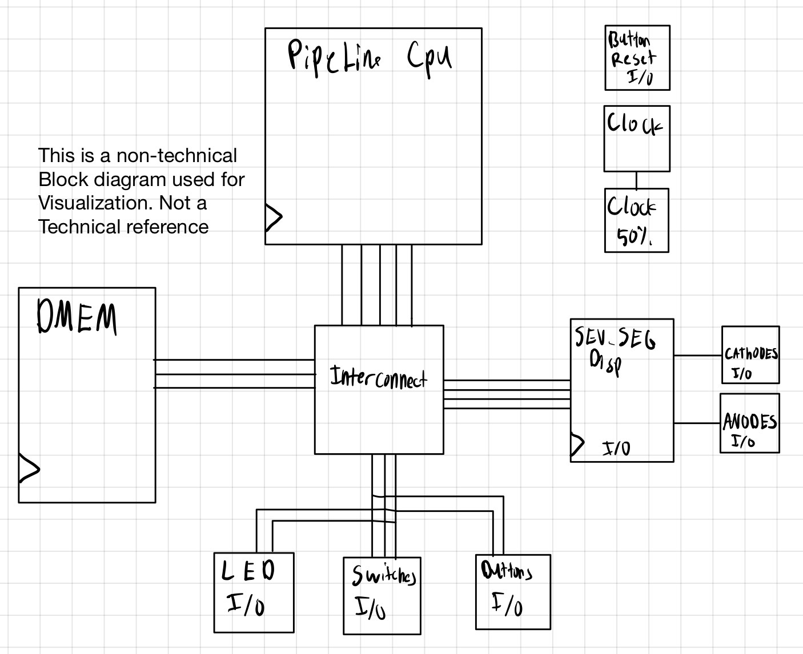

# RV32I_Pipeline_FPGA
9/10/2026: Currently being creating tb for each module and testing in Cadence Xcelium

All RTL excpet for SEV_SEG_DISP, BCDMOD, and CathodeDriver(Made by Professor Pummel)
is made purley by Drew Nakamura.

Most if not all Test benches are made with LLM models under my prompting.

## **CPU Diagram**

This is a non-technical reference for visualizing the pipelined CPU as a block diagram. Wires and connections between blocks may not be completely accurate.

## **MCU Diagram**

This is a non-technical reference for visualizing the MCU as a block diagram. Wires and connections between blocks may not be completely accurate.

